# Лаба 2 — Полный мониторинг маленького сервиса

**Авторы:** Чурилина Полина Олеговна, Арбузина Елена Романовна
**Группа:** К3320
**Репозиторий:** https://github.com/churilina-polina/ict-administration → папка `lab_2/`

---

## О чём вообще эта лаба

Задание звучит так: взять простой HTTP-сервис и «обклеить» его наблюдаемостью — метрики, логи, трейсы и алерты. Мы примерно понимали, что такое сервис, но что такое «наблюдаемость» и зачем к одному приложению цеплять семь сторонних программ — сначала было совсем не очевидно. Разобрались по ходу, и вот к чему пришли.

Наблюдаемость — это три независимых способа посмотреть, что происходит внутри работающей программы:

- **метрики** — числа во времени: сколько запросов, сколько ошибок, как быстро отвечаем;
- **логи** — текстовые записи «что случилось в такой-то момент»;
- **трейсы** — путь одного конкретного запроса: из каких шагов он состоял и где потратил время.

Плюс поверх метрик — **алерты**: если что-то идёт не так, система сама присылает уведомление.

Всё это мы подняли локально через Docker Compose. Одна команда — и работает 8 контейнеров: наш сервис и 7 инструментов вокруг него.

---

## Что в итоге лежит в папке

```
lab_2/
├── docker-compose.yml            ← поднимает все 8 контейнеров одной командой
├── service/                      ← наш сервис
│   ├── app.py                    ← весь код: 3 ручки нагрузки + метрики + логи + трейсы
│   ├── requirements.txt          ← список Python-библиотек
│   └── Dockerfile                ← как упаковать сервис в контейнер
├── prometheus/
│   ├── prometheus.yml            ← откуда собирать метрики и куда слать алерты
│   └── alert.rules.yml           ← три правила алертов
├── grafana/provisioning/         ← Grafana настраивает себя сама при старте
│   ├── datasources/…             ← подключить Prometheus и Loki
│   └── dashboards/…              ← готовый дашборд RED
├── loki/loki-config.yml          ← настройки хранилища логов
├── promtail/promtail-config.yml  ← что читать и куда отправлять логи
├── alertmanager/alertmanager.yml ← куда доставлять сработавшие алерты
└── images/                       ← скриншоты для этого отчёта
```

### Из чего собран стек

| Контейнер | Образ | Порт | За что отвечает |
|---|---|---|---|
| `demo-service` | собираем сами из `./service` | 8000 | тестовый сервис: нагрузка, метрики, логи, трейсы |
| `prometheus` | `prom/prometheus:v3.1.0` | 9090 | собирает метрики, проверяет правила алертов |
| `alertmanager` | `prom/alertmanager:v0.28.0` | 9093 | принимает сработавшие алерты, шлёт уведомления |
| `webhook` | `mendhak/http-https-echo` | 8081 | приёмник уведомлений (наш «почтовый ящик» для проверки) |
| `grafana` | `grafana/grafana:11.4.0` | 3000 | дашборды по метрикам и просмотр логов |
| `loki` | `grafana/loki:3.3.2` | 3100 | хранилище логов |
| `promtail` | `grafana/promtail:3.3.2` | — | читает файл логов сервиса и отправляет в Loki |
| `jaeger` | `jaegertracing/all-in-one:1.65.0` | 16686 | приём и просмотр трейсов |

Контейнеры сидят в одной сети Docker и обращаются друг к другу по именам (`service`, `prometheus`, `loki`, `jaeger`). Файл логов передаётся между сервисом и Promtail через общий том `applogs` — это, по сути, общая папка на двоих.

---

## Как запустить

```bash
cd lab_2
docker compose up --build
```

Первый раз собирается минуты 2–4 (ставятся Python-библиотеки в образ сервиса). Дальше проверяем во втором окне терминала:

```bash
docker compose ps
```

Все 8 контейнеров должны быть `Up`.

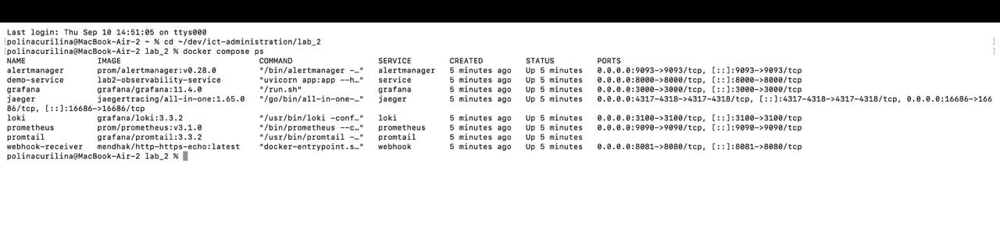

Открываем http://localhost:8000 — это страница сервиса с тремя кнопками. Каждая кнопка запускает свой вид нагрузки на 90 секунд, чтобы мониторинг успел среагировать, а мы успели сделать скриншот.

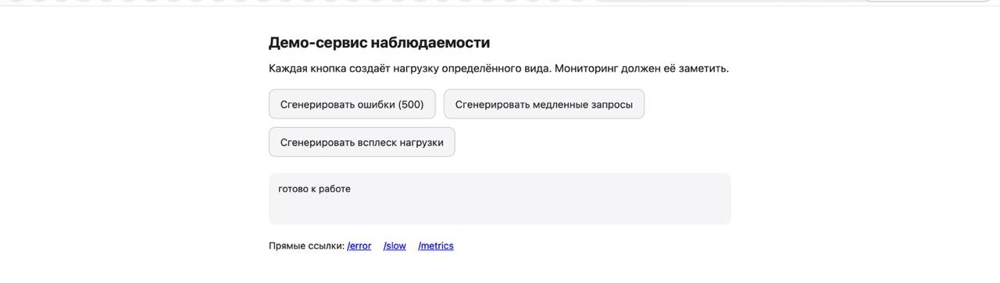

Веб-интерфейсы: Prometheus — http://localhost:9090, Grafana — http://localhost:3000, Jaeger — http://localhost:16686, Alertmanager — http://localhost:9093.

Остановить всё: `docker compose down` (с `-v` — вместе с данными).

---

## Часть 1. Сервис

Весь сервис — один файл `service/app.py`. Взяли Python и FastAPI, потому что на нём меньше всего кода и много готовых примеров под OpenTelemetry.

### Три ручки нагрузки

| Ручка | Что делает |
|---|---|
| `GET /error` | всегда отвечает кодом **500**. Внутри создаёт спан `broken-operation` и помечает его как ошибочный |
| `GET /slow` | отвечает через случайные **1–3 секунды**. Внутри — вложенный спан `slow-operation` (там просто `asyncio.sleep`) |
| `POST /load?target=error\|slow\|fast` | запускает в фоне поток, который 90 секунд сам себе шлёт запросы выбранного вида |

Сначала мы сделали `/load` так, чтобы он слал фиксированное число запросов и сразу заканчивал. Оказалось, что этого мало: нагрузка кончалась за пару секунд, алерт не успевал перейти в `FIRING`, и заскриншотить его было невозможно. Переделали на «слать запросы равномерно в течение 90 секунд» — вот тогда всё стало ловиться спокойно.

### Метрики по методу RED

**RED** — это Rate, Errors, Duration. Три числа, которых хватает, чтобы понять здоровье почти любого сервиса. Объявили две метрики:

```python
REQUESTS = Counter(
    "http_requests_total", "Количество HTTP-запросов",
    ["method", "path", "status"],
)
LATENCY = Histogram(
    "http_request_duration_seconds", "Время обработки запроса в секундах",
    ["method", "path"],
    buckets=(0.05, 0.1, 0.25, 0.5, 1, 2, 3, 5),
)
```

- `http_requests_total` — счётчик, растёт на 1 с каждым запросом. Метка `status` даёт сразу и **Rate** (все запросы), и **Errors** (`status=~"5.."`).
- `http_request_duration_seconds` — гистограмма, раскладывает запросы по «корзинам» времени. Из неё считается **Duration** и перцентили.

Обновляет обе метрики один кусок кода — middleware `observe`, который оборачивает **каждый** запрос: засекает время в начале, после ответа инкрементирует счётчик, кладёт длительность в гистограмму и пишет строку лога.

### JSON-логи с trace_id

Обычный лог — свободный текст, по нему тяжело искать. Мы сделали так, что каждая строка лога — это JSON-объект:

```json
{"time": "2026-09-10T10:22:49", "level": "INFO", "message": "request handled",
 "method": "GET", "path": "/error", "status": 500, "duration_ms": 1.0,
 "trace_id": "0c35140ad507593d0bf123677f4f70a1"}
```

`trace_id` берётся из текущего спана OpenTelemetry. Именно по нему потом можно взять строчку из логов и открыть ровно этот же запрос в Jaeger. Логи пишутся в два места: в консоль контейнера и в файл `/logs/app.log` — из файла их забирает Promtail.

### Dockerfile

```dockerfile
FROM python:3.12-slim
WORKDIR /app
COPY requirements.txt .
RUN pip install --no-cache-dir -r requirements.txt
COPY app.py .
EXPOSE 8000
CMD ["uvicorn", "app:app", "--host", "0.0.0.0", "--port", "8000"]
```

Сначала копируем и ставим зависимости, потом код. Порядок важен: Docker кеширует слой с библиотеками, и при правке `app.py` он не переустанавливает их заново.

---

## Часть 2. Метрики: Prometheus + Grafana

### Prometheus

Prometheus сам ходит на адреса из списка и забирает метрики — это называется «скрейп». Конфиг `prometheus/prometheus.yml`:

```yaml
global:
  scrape_interval: 5s        # ходить каждые 5 секунд
  evaluation_interval: 5s    # так же часто проверять правила алертов

alerting:
  alertmanagers:
    - static_configs:
        - targets: ["alertmanager:9093"]

rule_files:
  - /etc/prometheus/alert.rules.yml

scrape_configs:
  - job_name: demo-service
    static_configs:
      - targets: ["service:8000"]
  - job_name: prometheus
    static_configs:
      - targets: ["localhost:9090"]
```

`service` — это имя контейнера, Prometheus сам добавит `/metrics`. Проверяем на странице **Status → Target health**: цель `demo-service` в состоянии `UP`. Если бы тут было `DOWN`, ни один график в Grafana не заработал бы, поэтому это первое, что мы проверили.

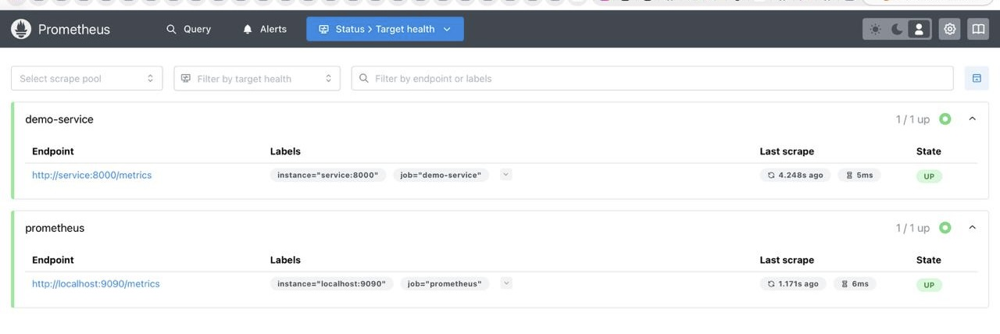

### Grafana

Отдельно порадовало, что Grafana умеет настраивать себя из файлов при старте — не нужно кликать мышкой. Папка `grafana/provisioning/`:

- `datasources/datasources.yml` — подключает Prometheus (`http://prometheus:9090`) и Loki (`http://loki:3100`);
- `dashboards/dashboards.yml` — говорит «загрузить дашборды из этой папки»;
- `dashboards/red-dashboard.json` — сам дашборд.

Поэтому при первом заходе в Grafana дашборд и источники данных уже были на месте.

### Дашборд RED

Три панели:

| Панель | Запрос (PromQL) |
|---|---|
| **Request Rate** — запросов в секунду | `sum(rate(http_requests_total[1m]))` |
| **Error Rate** — доля 5xx, % | `100 * sum(rate(http_requests_total{status=~"5.."}[1m])) / clamp_min(sum(rate(http_requests_total[1m])), 0.001)` |
| **Duration** — p50 / p95 / p99, с | `histogram_quantile(0.95, sum(rate(http_request_duration_seconds_bucket[1m])) by (le))` (и для 0.5, 0.99) |

Здесь `rate(...[1m])` — это «скорость роста счётчика за минуту», то есть запросов в секунду. `clamp_min(..., 0.001)` в знаменателе — костыль от деления на ноль, когда трафика вообще нет.

В спокойном состоянии Request Rate почти по нулям, а на Error Rate написано «No data». Сначала мы решили, что что-то сломали. Потом дошло: ошибок ещё не было ни одной, доля ошибок — это деление, а делить нечего, вот Grafana и пишет «нет данных». Это нормальное состояние «всё хорошо».

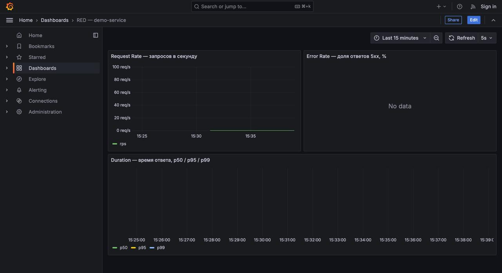

Дальше нажали кнопки нагрузки — **по одной, с паузами**. В первый раз мы нажали все три сразу, и сработала только Request Rate, а Error Rate и Duration почти не шелохнулись. Оказалось, поток успешных запросов от кнопки «всплеск» разбавляет долю ошибок (3 ошибки на 65 запросов — это 4%, а не 100%) и занижает общий p95. Когда развели нажатия по времени, на дашборде стали видны три отдельных «холмика»: пик Request Rate до ~65 rps, подъём Error Rate до 100%, рост p95 до ~3 секунд.

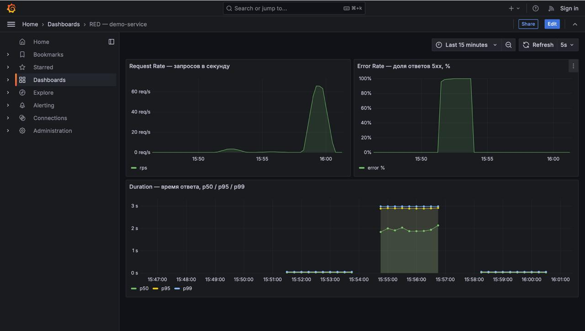

---

## Часть 3. Логи: Loki + Promtail

Тут два инструмента с разными задачами:

- **Loki** (`loki/loki-config.yml`) — хранилище логов. По сути тот же Prometheus, только для текста, а не для чисел. Конфиг минимальный: хранить на диске, без аутентификации.
- **Promtail** (`promtail/promtail-config.yml`) — «подвозчик». Читает файл логов и отправляет в Loki:

```yaml
clients:
  - url: http://loki:3100/loki/api/v1/push

scrape_configs:
  - job_name: demo-service-file
    static_configs:
      - targets: [localhost]
        labels:
          job: demo-service
          __path__: /logs/*.log
    pipeline_stages:
      - json:                    # каждая строка — JSON, разобрать поля
          expressions:
            level: level
            trace_id: trace_id
            path: path
            status: status
      - labels:                  # часть полей сделать метками для фильтрации
          level:
          path:
```

Отдельно повозились с тем, чтобы `trace_id` из лога стал доступен для поиска — за это отвечает стадия `json` в конфиге Promtail, которая разбирает JSON-строку на поля. Файл `/logs/app.log` попадает к Promtail через общий том `applogs`.

### Проверка

Grafana → **Explore** → источник **Loki** → запрос:

```logql
{job="demo-service", path="/error"} |= "request handled"
```

(Сначала мы искали по `|= "ERROR"` и попадали на служебную строку без `trace_id`. Строка `"request handled"` — основная, она пишется по каждому запросу и содержит и `status`, и `trace_id`.)

В развёрнутой строке видно `status = 500` и `trace_id`. Этот же `trace_id` мы дальше вставили в Jaeger и открыли тот же самый запрос.

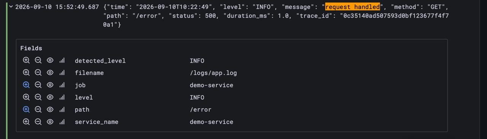

---

## Часть 4. Трейсы: OpenTelemetry + Jaeger

### Что добавили в код

Настройка экспортёра трейсов (`service/app.py`):

```python
resource = Resource.create({"service.name": "demo-service"})
provider = TracerProvider(resource=resource)
provider.add_span_processor(
    BatchSpanProcessor(OTLPSpanExporter(endpoint="http://jaeger:4317", insecure=True))
)
trace.set_tracer_provider(provider)
```

Адрес Jaeger задаётся переменной окружения `OTEL_EXPORTER_OTLP_ENDPOINT` в `docker-compose.yml` — так его удобно менять, не трогая код.

Автоматические спаны на каждый входящий запрос включаются одной строкой:

```python
FastAPIInstrumentor.instrument_app(app)
HTTPXClientInstrumentor().instrument()
```

Тут был неочевидный момент: авто-инструментирование даёт только один спан на весь запрос. Всё, что интереснее — вложенные шаги и пометку ошибки — надо расставлять в коде руками:

- `slow-operation` в `/slow` — оборачивает `asyncio.sleep`;
- `broken-operation` в `/error` — помечается статусом ошибки, и в него записывается исключение:

```python
span.record_exception(exc)
span.set_status(trace.Status(trace.StatusCode.ERROR, "synthetic failure"))
```

### Jaeger

Контейнер `jaeger` (образ `all-in-one`) принимает трейсы по протоколу OTLP на портах 4317/4318, интерфейс — на 16686. «All-in-one» — это когда приёмник, хранилище и UI собраны в один контейнер; для учёбы удобно, в реальном проекте это разные компоненты, и между сервисом и Jaeger обычно ставят OpenTelemetry Collector (в задании он помечен как опциональный, мы его не делали).

### Проверка

Открыли Jaeger, выбрали Service = `demo-service`, Operation = `GET /slow`. В списке 20 трейсов, каждый по 1.5–3 секунды — сразу видно длинные полоски длительности. (Если оставить Operation = `all`, список забивается служебными `GET /metrics` — это Prometheus каждые 5 секунд опрашивает сервис, они по 2–4 миллисекунды и для отчёта неинтересны.)

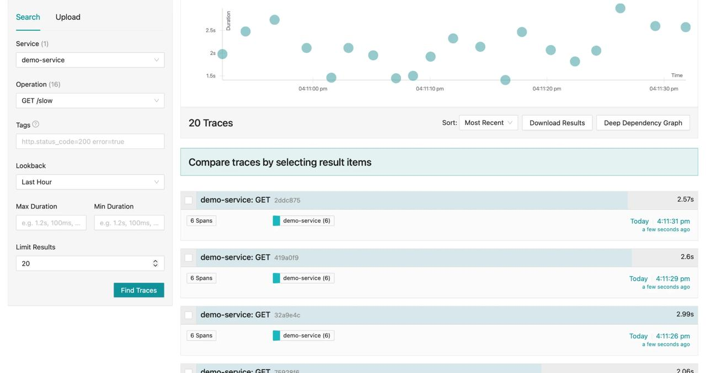

Открыли один трейс — это «водопад». Видно вложенность: `GET` → `GET /slow` → `slow-operation` (чёрная полоса почти на всю длину — это и есть искусственная задержка). Ниже три коротких `http send` — это спаны httpx-клиента, которым сервис сам себя нагружает. `Depth 3`, `Total Spans 6`.

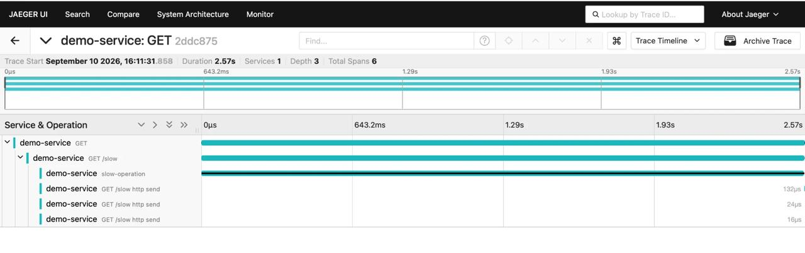

Дальше взяли `trace_id` из строки логов Loki и вставили его в поиск Jaeger — открылся ровно тот запрос, который упал с ошибкой. Все спаны красные, у `broken-operation` теги `error = true` и `otel.status_code = ERROR`, в блоке **Logs** — событие `exception` с сообщением `synthetic failure for testing`. Ещё видно `telemetry.sdk.language = python` — подтверждение, что трейс пришёл именно из нашего сервиса.

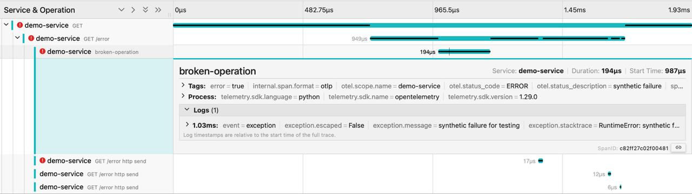

---

## Часть 5. Алерты: Prometheus + Alertmanager

### Три правила

Файл `prometheus/alert.rules.yml`, группа `red-alerts`:

```yaml
groups:
  - name: red-alerts
    rules:
      - alert: HighErrorRate
        expr: |
          sum(rate(http_requests_total{status=~"5.."}[1m]))
          / clamp_min(sum(rate(http_requests_total[1m])), 0.001) > 0.10
        for: 30s
        labels: { severity: critical }
        annotations:
          summary: "Высокая доля ошибок (>10%)"
          description: "Доля ответов 5xx превысила 10% за последнюю минуту. Провоцируется кнопкой «Сгенерировать ошибки»."

      - alert: RequestSpike
        expr: sum(rate(http_requests_total[1m])) > 8
        for: 30s
        labels: { severity: warning }
        annotations:
          summary: "Всплеск числа запросов (>8 rps)"
          description: "Частота запросов превысила 8 запросов в секунду за последнюю минуту. Провоцируется кнопкой «Сгенерировать всплеск нагрузки»."

      - alert: HighLatency
        expr: |
          histogram_quantile(0.95,
            sum(rate(http_request_duration_seconds_bucket[1m])) by (le)) > 1.5
        for: 30s
        labels: { severity: warning }
        annotations:
          summary: "Высокая задержка p95 (>1.5 c)"
          description: "95-й перцентиль времени ответа превысил 1.5 секунды за последнюю минуту. Провоцируется кнопкой «Сгенерировать медленные запросы»."
```

Каждое правило — это одна буква RED. `for: 30s` значит «условие должно продержаться 30 секунд подряд», и только тогда алерт из жёлтого `PENDING` становится красным `FIRING`. Это защита от разовых скачков.

В спокойном состоянии все три — зелёные, `INACTIVE (3)`.

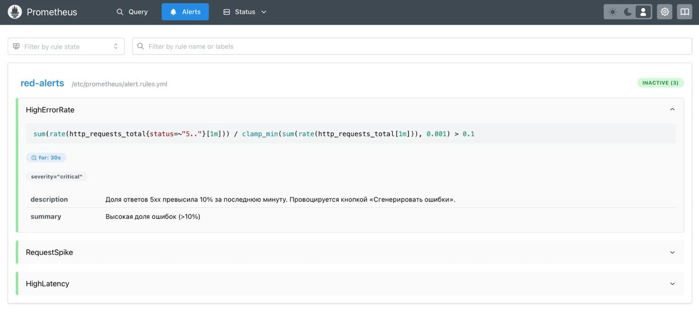

Выражения `RequestSpike` и `HighLatency` крупнее:

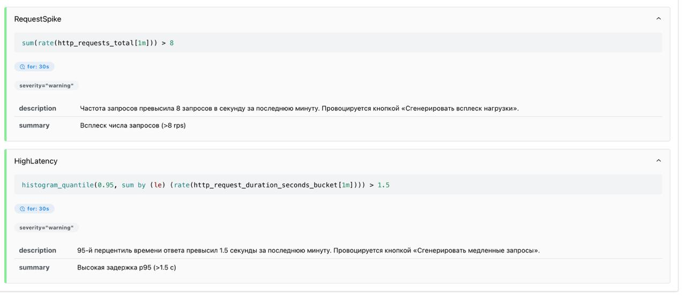

### Alertmanager

Файл `alertmanager/alertmanager.yml`:

```yaml
route:
  receiver: webhook-default
  group_by: ["alertname"]
  group_wait: 5s
  group_interval: 10s
  repeat_interval: 1h

receivers:
  - name: webhook-default
    webhook_configs:
      - url: http://webhook:8080/
        send_resolved: true
```

Из вариантов доставки (webhook / Slack / email) взяли **webhook** — не нужен ни аккаунт в Slack, ни почтовый сервер. Уведомления уходят на контейнер `webhook`, который просто печатает всё присланное в свой лог. Это удобный «почтовый ящик» для проверки. `send_resolved: true` — слать уведомление ещё и когда алерт погас.

### Проверка

Каждый алерт провоцировали **своей кнопкой по одному, с паузами 2–3 минуты** — по той же причине, что и с дашбордом: одновременная нагрузка искажает метрики друг друга.

**HighErrorRate** — `FIRING`, `Value = 1` (доля ошибок = 100%):

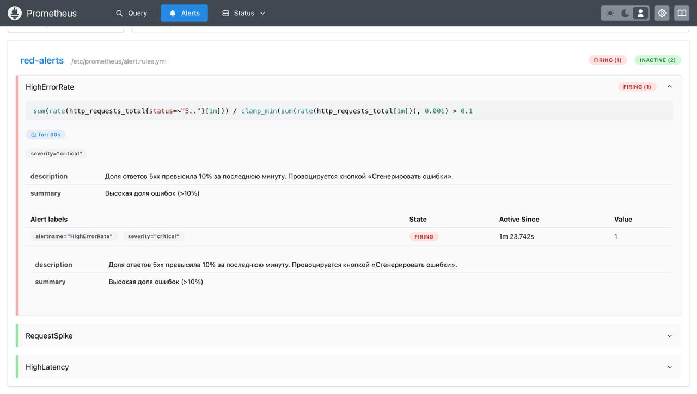

**HighLatency** — `FIRING`, `Value ≈ 2.91` (p95 ≈ 2.9 с при пороге 1.5):

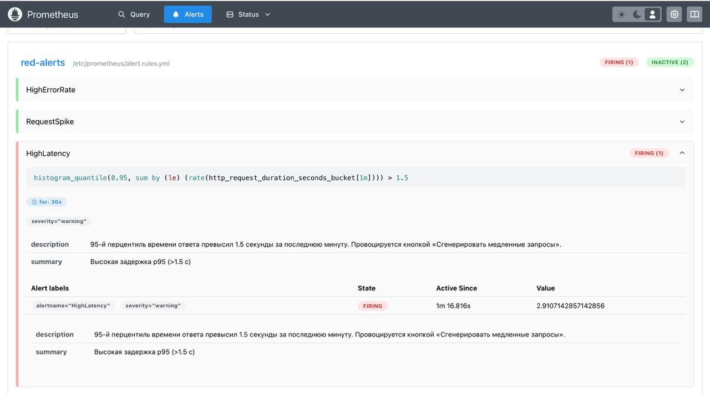

**RequestSpike** — `FIRING`, `Value ≈ 45.86` (≈46 rps при пороге 8):

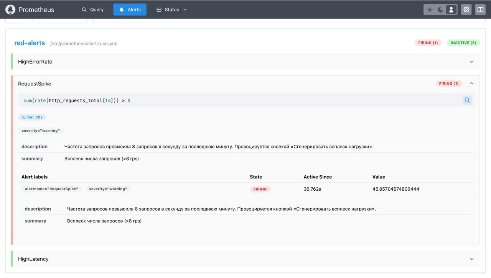

И, наконец, уведомление реально долетело — в логе контейнера `webhook` видно POST от Alertmanager с телом `"status": "firing"` и `"alertname"`:

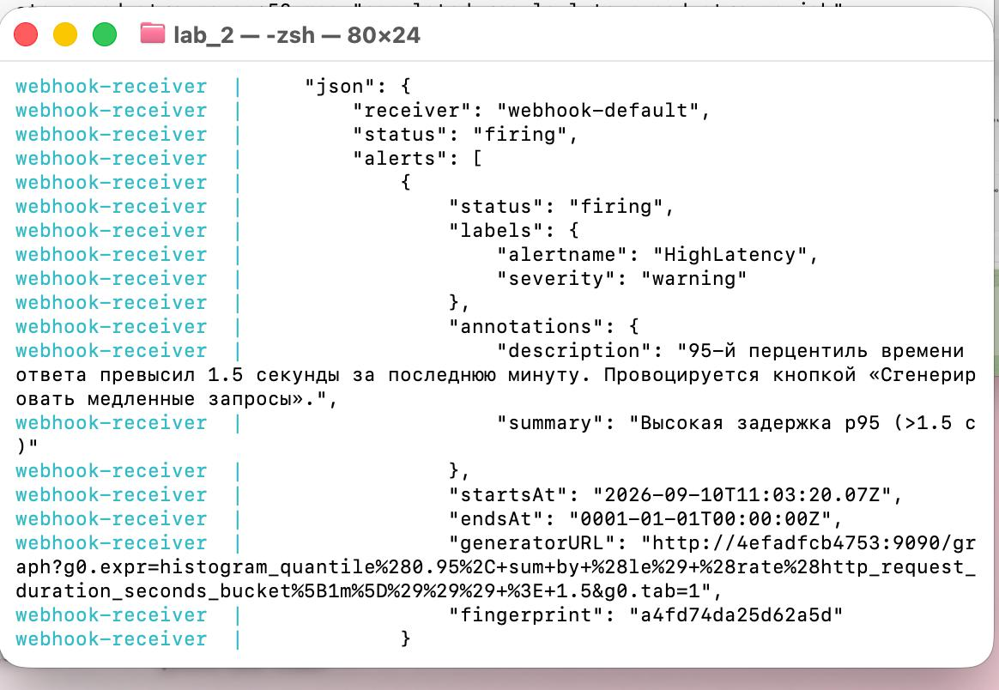

Полная цепочка получилась такая: **сервис → Prometheus (собрал метрику, проверил правило) → Alertmanager (сгруппировал) → webhook (доставка)**.

---

## Почему мы выбрали именно эти метрики

Мы вынесли на дашборд три метрики метода **RED** — Rate, Errors, Duration.

Взяли именно RED, потому что это минимальный набор, который работает для любого сервиса типа «запрос — ответ», и не зависит от того, что этот сервис делает. Три числа отвечают на три разных вопроса:

- **Rate** — какая сейчас нагрузка. Без него нельзя понять остальное: 5 ошибок в секунду при 10 запросах и при 1000 запросах — это очень разные ситуации.
- **Errors** — надёжность. Мы взяли именно **долю** ошибок, а не абсолютное число: 1% при большом трафике и 50% при маленьком — принципиально разное, а счётчик их не различает.
- **Duration** — насколько быстро отвечаем с точки зрения пользователя. Показали **перцентили p50 / p95 / p99**, а не среднее, потому что среднее прячет «хвост»: если 95 запросов быстрые, а 5 висят по 3 секунды, по среднему всё нормально, а по p95 — уже нет. p50 — типичный запрос, p95 — по нему обычно судят о деградации, p99 — редкие выбросы.

Ещё один плюс RED: эти же три метрики придётся настраивать в каждой следующей лабе курса, так что разобраться в них сейчас — вложение на весь семестр.

---

## Почему именно такие алерты

Сделали три правила — по одному на каждую букву RED, каждое ловит свой сценарий поломки.

**HighErrorRate — доля 5xx больше 10%, `severity: critical`.**
Это прямые отказы: пользователь видит ошибку вместо результата. Порог 10% выбрали так, чтобы единичные 5xx (сетевые сбои, перезапуски) не будили дежурного — они неизбежны и инцидентом не являются. А вот если ошибок стабильно больше 10% — что-то реально сломалось. `critical`, потому что реагировать надо сразу.

**RequestSpike — больше 8 запросов в секунду, `severity: warning`.**
Резкий рост трафика: наплыв пользователей, зациклившийся клиент, бот, нагрузка типа DDoS. Само по себе это не авария, но надо посмотреть — справится ли сервис, хватит ли ресурсов. Поэтому `warning`, а не `critical`. Порог 8 rps подобрали относительно обычной нагрузки нашего сервиса (в покое ≈ 0, кнопка «медленные» даёт ≈ 0.5, кнопка «всплеск» — десятки). В реальном проекте порог ставят от исторических данных, например втрое выше обычного пика.

**HighLatency — p95 больше 1.5 секунды, `severity: warning`.**
Сервис «тормозит»: медленная база, внешний API не отвечает, не хватает процессора. Порог 1.5 секунды — граница, за которой отклик уже ощущается как медленный. Взяли p95, чтобы заметить проблему на «хвосте» раньше, чем она затронет большинство запросов. `warning`, потому что сервис ещё отвечает, просто плохо.

**`for: 30s` у всех трёх** — условие должно держаться полминуты. Это убирает ложные срабатывания на секундных пиках (один медленный запрос, всплеск при деплое).

Значения при срабатывании получились с большим запасом за порогами: 100% против 10%, 2.9 с против 1.5 с, 46 rps против 8 — то есть правила действительно ловят то, что должны.

---

## Выводы

Что мы поняли про каждый из трёх «столпов»:

- **Метрики** говорят «что-то не так и насколько плохо», но не «почему». По графику видно, что доля ошибок подскочила, но не видно, какой запрос падает и на какой строчке.
- **Логи** дают текст конкретного события и `trace_id`. Но по ним тяжело увидеть общую картину и понять, сколько времени заняли шаги.
- **Трейсы** показывают путь одного запроса и где именно потрачено время — то, чего не видно ни в метриках, ни в логах.

Главное, что до нас дошло — это **связка через `trace_id`**. Именно она превращает три отдельных инструмента в один рабочий процесс: на дашборде замечаешь аномалию → в логах находишь конкретную ошибочную строку и её `trace_id` → в Jaeger по этому `trace_id` открываешь ровно этот запрос и видишь, на каком шаге и с какой ошибкой он упал. Мы это проверили руками: `trace_id` из лога открыл в Jaeger тот же самый запрос.

Что было непонятно и с чем повозились:
- почему при одновременном нажатии всех кнопок половина метрик не реагирует (ответ: успешный трафик «разбавляет» ошибки и занижает p95);
- что пустой график Error Rate («No data») — это норма, а не поломка;
- что вложенные спаны и пометку ошибки в трейсе надо расставлять в коде вручную;
- как сделать, чтобы `trace_id` из JSON-лога стал полем, по которому можно фильтровать в Grafana.

Чего не хватает для «взрослой» версии:
- OpenTelemetry Collector между сервисом и Jaeger, чтобы приложение не знало адрес и формат бэкенда трейсов;
- нормальное хранение метрик и логов — с ретеншеном, на постоянных дисках, с бэкапами (сейчас данные Loki и Jaeger живут в контейнере и пропадают после `docker compose down -v`);
- маршрутизация алертов по severity в Alertmanager: `critical` — звонок, `warning` — сообщение в чат;
- дашборды с разбивкой по эндпоинтам, а не только общий по сервису.

---

## Про инструменты

Писали на Python + FastAPI, метрики — через `prometheus_client`, трейсы — через `opentelemetry-sdk`. Инфраструктура: Docker Compose, Prometheus, Alertmanager, Grafana, Loki, Promtail, Jaeger.

По политике курса (`AGENTS.md` / `CLAUDE.md`) пользовались AI-ассистентом — для генерации каркаса конфигов и кода сервиса и для пошагового разбора незнакомых компонентов.
