# Лаба 3 — Kafka для двух сервисов: подними и настрой с нуля

**Авторы:** Чурилина Полина Олеговна, Арбузина Елена Романовна
**Группа:** К3320
**Репозиторий:** https://github.com/churilina-polina/ict-administration → папка `lab_3/`

---


## О чём лаба

Собираем мини-конвейер доставки: **user-service** создаёт заказ и публикует событие в Kafka, **picker-service** читает эту же Kafka группой потребителей и «собирает» заказ. Сами сервисы — вспомогательная часть, а основная работа — **поднять и настроить Kafka с нуля через конфигурацию** (docker-compose, без ручных `kafka-topics.sh`-команд) и разобрать на этом стенде реальные бизнес-ситуации: масштабирование под нагрузку, падение сборщика, пересчёт истории, устаревание данных. Плюс — обязательный мониторинг.

---

## Структура репозитория

```
lab_3/
├── docker-compose.yml            ← поднимает весь стек одной командой
├── user-service/                 ← продюсер: HTTP-страница + кнопка «Создать заказ»
│   ├── app.py
│   ├── requirements.txt
│   └── Dockerfile
├── picker-service/                ← консьюмер: разбирает топик группой потребителей
│   ├── app.py
│   ├── requirements.txt
│   └── Dockerfile
├── topic-init/                   ← декларативное создание/обновление топика orders
│   ├── init_topic.py
│   ├── requirements.txt
│   └── Dockerfile
├── prometheus/
│   ├── prometheus.yml
│   └── alert.rules.yml
├── alertmanager/alertmanager.yml
├── grafana/provisioning/          ← Grafana настраивает себя сама при старте
│   ├── datasources/datasources.yml
│   └── dashboards/{dashboards.yml, kafka-dashboard.json}
└── images/                        ← скриншоты для этого отчёта
```

### Из чего собран стек

| Контейнер | Образ | Порт | За что отвечает |
|---|---|---|---|
| `kafka` | `apache/kafka:3.9.0` | 9092 | сам брокер, режим KRaft (без ZooKeeper) |
| `topic-init` | собираем из `./topic-init` | — | создаёт/обновляет топик `orders` по конфигу и завершается |
| `user-service` | собираем из `./user-service` | 8010 | продюсер: кнопка «Создать заказ» |
| `picker-service` | собираем из `./picker-service` | 8001 | консьюмер: «собирает» заказы |
| `kafka-ui` | `provectuslabs/kafka-ui:v0.7.2` | 8080 | веб-интерфейс Kafka |
| `kafka-exporter` | `danielqsj/kafka-exporter` | 9308 | отдаёт метрики Kafka в формате Prometheus |
| `prometheus` | `prom/prometheus:v3.1.0` | 9091 | собирает метрики, проверяет правила алертов |
| `alertmanager` | `prom/alertmanager:v0.28.0` | 9094 | принимает сработавшие алерты |
| `webhook` | `mendhak/http-https-echo` | 8082 | приёмник уведомлений (для проверки) |
| `grafana` | `grafana/grafana:11.4.0` | 3001 | дашборд по метрикам Kafka |

Контейнеры сидят в одной сети docker compose и обращаются друг к другу по именам сервисов (`kafka`, `prometheus`, …) — снаружи видны только проброшенные порты выше.

---

## Как запустить

```bash
cd lab_3
docker compose up -d --build
docker compose ps
```

Первый раз собирается несколько минут (тянутся образы Kafka/Grafana/Prometheus, ставится `confluent-kafka` в сервисы). Все контейнеры, кроме `topic-init`, должны быть `Up` (`topic-init` — `Exited (0)`, он одноразовый и просто настраивает топик при каждом запуске).

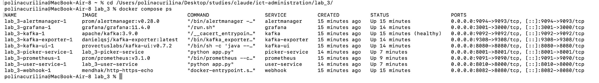

Веб-интерфейсы: user-service — http://localhost:8010, picker-service — http://localhost:8001, Kafka UI — http://localhost:8080, Prometheus — http://localhost:9091, Grafana — http://localhost:3001, Alertmanager — http://localhost:9094.

> Порты 8000/9090/3000/9093/8081 заняты стендом из `lab_2` (он тоже крутится локально) — поэтому у lab_3 свои, соседние номера портов. К самой Kafka это отношения не имеет, чисто чтобы два стенда не конфликтовали.

Остановить всё: `docker compose down` (с `-v` — вместе с данными Kafka, тогда следующий запуск создаст топик заново с 1 партицией).

---

## Часть 1 — Два сервиса

Оба сервиса на Python + Flask, каждый со своим Dockerfile, настройки — через переменные окружения (`KAFKA_BOOTSTRAP_SERVERS`, `KAFKA_TOPIC`, `KAFKA_GROUP_ID`, `INSTANCE_NAME`).

**user-service** (`user-service/app.py`) — на нажатие «Создать заказ» публикует событие в топик `orders`, ключ сообщения — `order_id` (чтобы события одного заказа всегда попадали в одну партицию). Дожидается подтверждения от брокера (`producer.flush()`) и показывает, в какую партицию и с каким 💅🏻offset💅🏻 ушло сообщение:

```python
producer.produce(
    topic=KAFKA_TOPIC,
    key=order_id.encode("utf-8"),
    value=json.dumps(order, ensure_ascii=False).encode("utf-8"),
    callback=on_delivery,
)
producer.flush(10)
```

**picker-service** (`picker-service/app.py`) — в фоновом потоке читает топик группой потребителей `pickers`, на каждое сообщение «собирает» заказ (`time.sleep(PROCESSING_SECONDS)`), затем коммитит offset вручную:

```python
consumer = Consumer({
    "bootstrap.servers": KAFKA_BOOTSTRAP_SERVERS,
    "group.id": KAFKA_GROUP_ID,
    "auto.offset.reset": "earliest",
    "enable.auto.commit": False,
})
...
consumer.commit(message=msg, asynchronous=False)
```

Страница picker-service также показывает, какие партиции сейчас назначены этому экземпляру (`on_assign`/`on_revoke`) — очень пригодилось в ситуациях 1–2, чтобы видеть распределение вживую, а не гадать🔮.

**Грабля:** в обоих шаблонах сначала было `{{ order.items | join(", ") }}`. В Jinja `.` сначала пробует атрибут, а у словаря `dict.items` — это метод (`dict_items` builtin), а не наш ключ `"items"`. Получали `TypeError: 'builtin_function_or_method' object is not iterable`. Фиксится явным `order["items"]`.

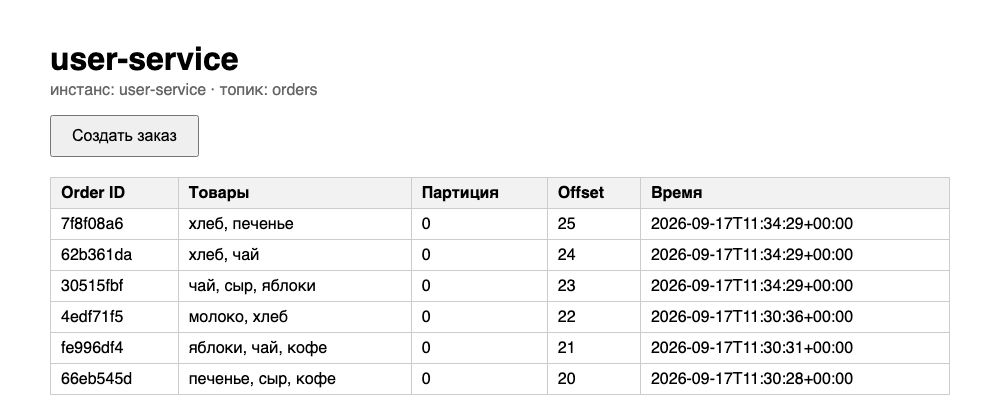

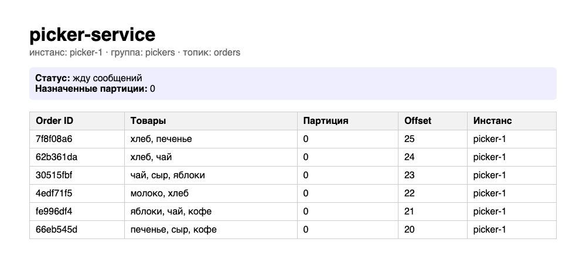

---

## Часть 2 — Kafka и топик из конфигурации

Kafka поднята в **KRaft**-режиме (без ZooKeeper) — конфигурация вынесена в `docker-compose.yml`, ключевое:

```yaml
KAFKA_PROCESS_ROLES: broker,controller
KAFKA_CONTROLLER_QUORUM_VOTERS: 1@kafka:9093
KAFKA_AUTO_CREATE_TOPICS_ENABLE: "false"
```

`KAFKA_AUTO_CREATE_TOPICS_ENABLE: "false"` — принципиальный момент: не даём Kafka создать топик `orders` сама с настройками по умолчанию, когда в неё придёт первое сообщение. Топик должен появиться только из явной конфигурации.

За это отвечает сервис `topic-init` (`topic-init/init_topic.py`) — маленький одноразовый контейнер, который через Kafka Admin API:

1. ждёт, пока брокер станет доступен (`healthcheck` + ретраи);
2. если топика `orders` нет — создаёт его с партициями/репликацией/retention из переменных окружения;
3. если топик уже есть — сравнивает текущие партиции и retention с желаемыми и **обновляет их без пересоздания топика**.

Партиции можно только **увеличивать**: Kafka физически не умеет схлопывать партиции существующего топика — пришлось бы решать, куда переносить уже записанные события, а порядок гарантируется только внутри партиции, так что «сжать» без потери порядка нельзя. Скрипт такую попытку просто замечает и объясняет в логе, не падая (см. ситуацию 1).

Любое изменение (число партиций, retention) — это правка `TOPIC_PARTITIONS` / `TOPIC_RETENTION_MS` в `docker-compose.yml` и `docker compose up -d --build topic-init`, никакого ручного `kafka-topics.sh`.

**Грабля:** обновление конфига топика мы сначала делали через `admin.alter_configs(...)`. Он **deprecated**, и не зря: это легаси-API🤟🏻, который **заменяет весь набор** динамических конфигов ресурса тем, что ты в него передал, а не мержит. Когда мы отдельным вызовом обновили только `segment.ms`, это тихо (не спеша, не дыша, не шиша, четыре карандаша и т.д.) стёрло ранее выставленный `retention.ms` — он откатился на дефолтные 7 дней, а мы полчаса не могли понять, почему сообщения не удаляются😭. Починили переходом на `admin.incremental_alter_configs(...)` — он меняет только то, что явно указано, остальное не трогает.


---

## Часть 3 — Бизнес-ситуации через конфигурацию

### Ситуация 1 — готовимся к распродаже, потом сворачиваемся

**Идея:** партиция — единица параллелизма. Чтобы заказы могли разбирать несколько сборщиков одновременно, нужно больше одной партиции (по умолчанию `TOPIC_PARTITIONS: "1"`).

**Что меняли:** в `docker-compose.yml` подняли💪🏻 `TOPIC_PARTITIONS` у `topic-init` до `"5"` и добавили ещё 5 сервисов по образцу `picker-service` (свой порт, свой `INSTANCE_NAME`, тот же `KAFKA_GROUP_ID: pickers`) — по одному сборщику на партицию плюс один лишний, чтобы заодно проверить ситуацию «сборщиков больше, чем партиций».

```bash
docker compose up -d --build   # применяем новые TOPIC_PARTITIONS и picker-service-2..6
```

Лог `topic-init` подтверждает увеличение:

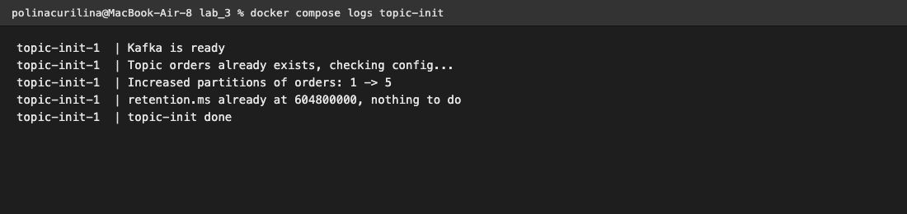

**Грабля:** после увеличения партиций до 5 все новые заказы всё равно шли в партицию 0. Причина — у продюсера `confluent-kafka` (librdkafka) внутри есть кеш метаданных топика (число партиций), который сам обновляется не сразу; у уже запущенного `user-service` в кеше так и осталось «1 партиция» с момента старта. Помогает `docker compose restart user-service` — процесс перезапускается, продюсер создаётся заново и подтягивает актуальные метаданные. После этого заказы честно разъехались по партициям 0–4:

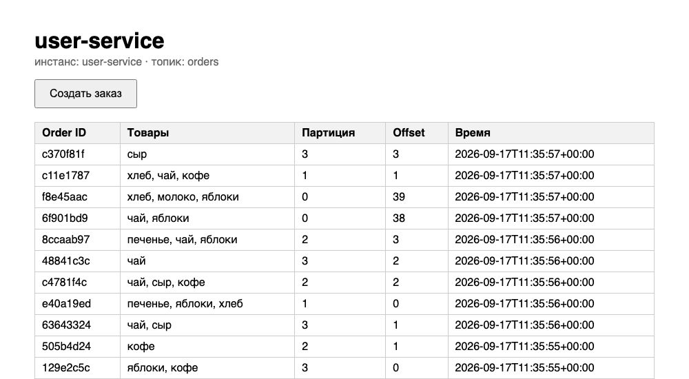

Один из сборщиков (`picker-2`) обрабатывает только «свою» партицию:

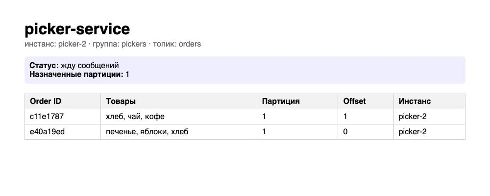

А шестой, лишний сборщик (`picker-3`) не получил ни одной партиции — внутри одной consumer group партиция достаётся ровно одному участнику, лишним просто нечего делать:

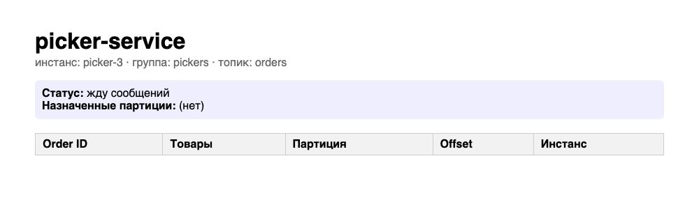

**Возврат обратно:** уменьшили `TOPIC_PARTITIONS` в конфиге до `"1"` и переприменили — Kafka партиции **не уменьшила**, `topic-init` это заметил и объяснил в логе, ничего не сломав:

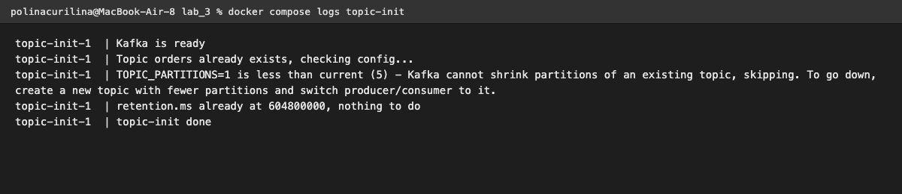

Лишних сборщиков после этого убрали из `docker-compose.yml` (`docker compose up -d --remove-orphans`), но сам топик так и остался с 5 партициями навсегда — увеличить и оставить как есть можно, откатить нельзя.

### Ситуация 2 — второй сборщик

Проверили одновременно с ситуацией 1 (см. скриншоты 04–05, 08 выше): подняли несколько `picker-service` в одной группе, создали заказы, увидели по страницам, как партиции поделились между сборщиками, и убедились, что лишний сборщик остаётся без работы.

### Ситуация 3 — сборщик упал во время деплоя

`docker compose stop picker-service`, создали несколько заказов на user-service. В Kafka UI (Consumers → `pickers`) видно: `State: EMPTY`, `Members: 0`, но `Total lag: 4` — сообщения никуда не делись, просто ждут, кому их отдать:

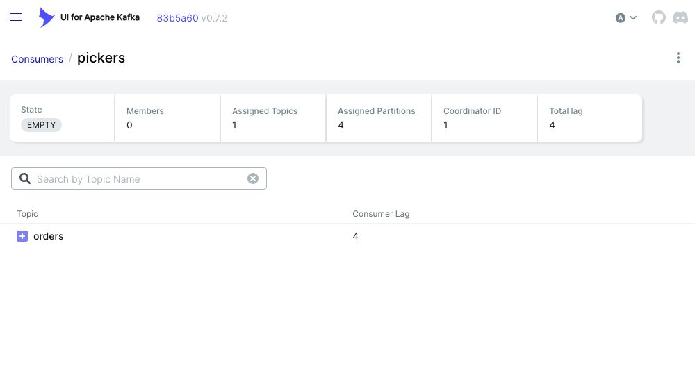

`docker compose start picker-service` — сборщик подключился, Kafka вспомнила💡 его последний закоммиченный offset и он тут же дособрал все накопившиеся заказы:

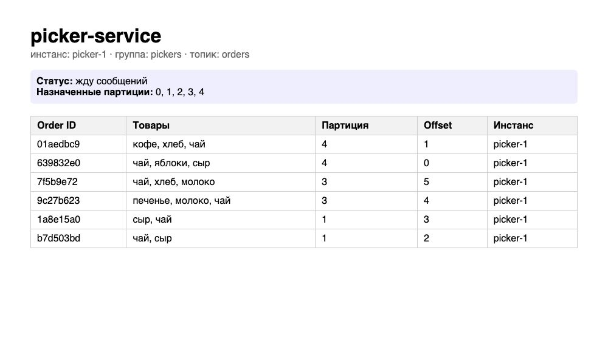

---

## Часть 4 — Kafka UI

Поднят как ещё один сервис в `docker-compose.yml` (`provectuslabs/kafka-ui`), адрес брокера и имя кластера — через переменные `KAFKA_CLUSTERS_0_BOOTSTRAPSERVERS` / `KAFKA_CLUSTERS_0_NAME`. Открывается на http://localhost:8080, в разделе Topics виден `orders` с его партициями и Message Count по каждой:

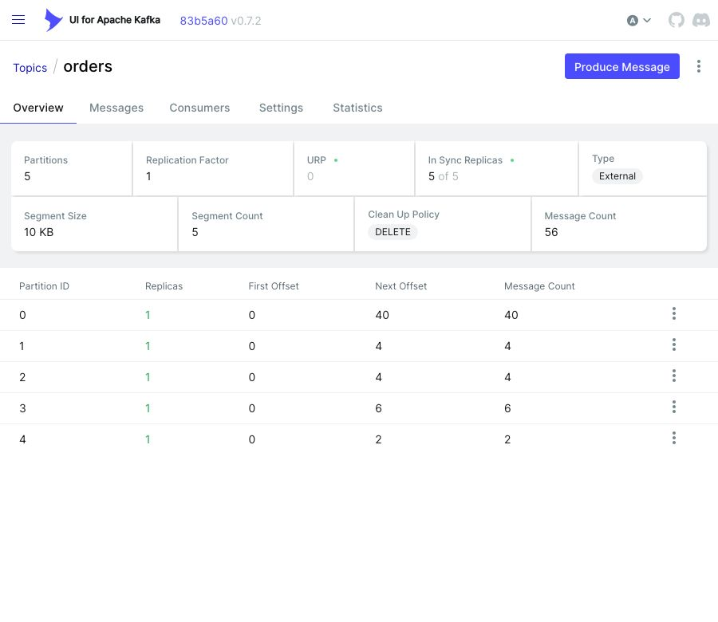

---

## Часть 5 — Бизнес-ситуации через Kafka UI

### Ситуация 4 — разбор жалобы на конкретный заказ

Создали заказ, запомнили его `order_id`. В Kafka UI → Topics → `orders` → Messages ввели этот `order_id` в поиск — нашли ровно одно сообщение с его партицией, offset'ом и содержимым:

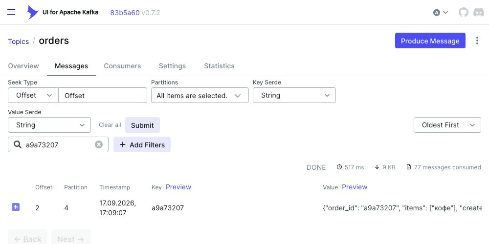

### Ситуация 5 — пересчёт истории для аналитики

Остановили всех сборщиков (Kafka UI не даёт сбросить offset живой группе), открыли Consumers → `pickers` → **Reset offset** → тип `EARLIEST`, выбрали все партиции:

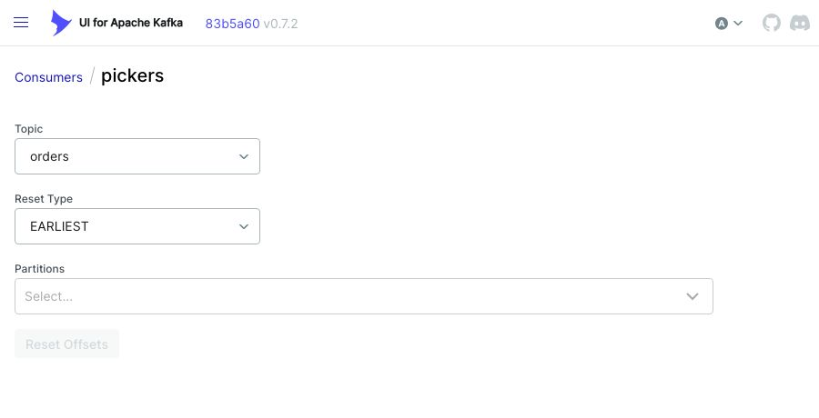

После сброса `Total lag` подскочил до 57 (всех сообщений в топике), (почти 67 блин), а запущенный заново picker-service начал заново собирать заказы с самого начала — offset 0, 1, 2…:

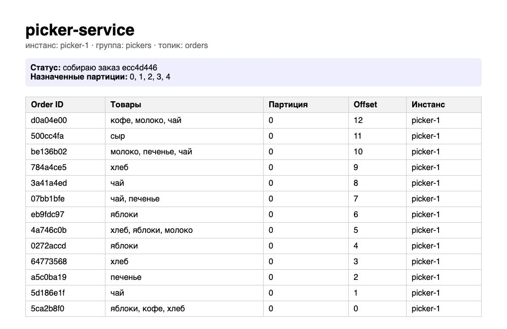

Это возможно только потому, что Kafka **не удаляет** сообщения после чтения (в отличие от классической очереди) — она хранит их до истечения retention и отдельно помнит текущую позицию чтения (offset) для каждой группы потребителей. Сбросить offset — не то же самое, что положить сообщение обратно в очередь: в RabbitMQ, например, прочитанное и подтверждённое сообщение из очереди физически удаляется, повторно прочитать его неоткуда.

### Ситуация 6 — диск заполняется старыми заказами

Уменьшили `TOPIC_RETENTION_MS` до `"60000"` (1 минута) и переприменили конфиг. Создали заказ, сразу нашли его в Kafka UI по order_id:

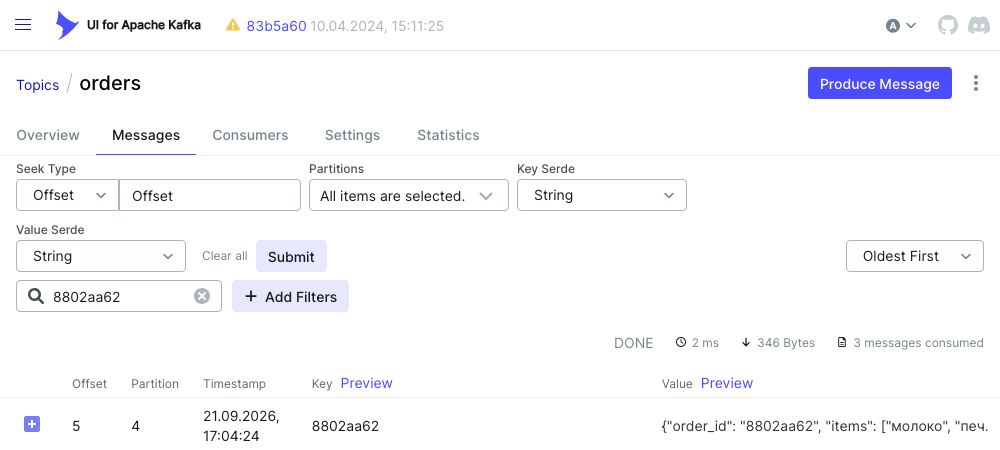

Через полторы минуты тот же поиск по тому же order_id — «No messages found»:

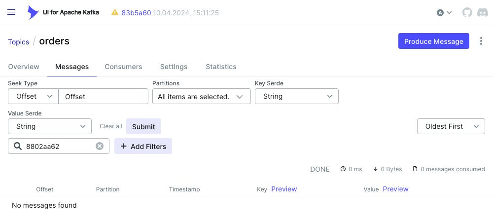

**Грабля (самая интересная в этой лабе):** после смены retention сообщения не удалялись даже спустя много минут. Оказалось, retention удаляет только **закрытые (rolled) сегменты** лога — активный сегмент, в который Kafka пишет прямо сейчас, не трогается никогда, сколько бы времени ни прошло. А закрывается сегмент по своим правилам (`segment.ms`, по умолчанию тоже 7 дней, или по размеру `segment.bytes`). При таком маленьком потоке сообщений, как у нас, активный сегмент сам никогда не «дорастал» и не закрывался — retention.ms был формально маленьким, но применять его было физически не к чему. Добавили в `topic-init` ещё один параметр — `TOPIC_SEGMENT_MS` (для этой ситуации выставили `"20000"`, заметно меньше retention) — сегмент стал закрываться каждые 20 секунд, и retention начал реально удалять старые данные. Проверили и на файловой системе брокера: после ожидания в каталоге партиции остался только новый пустой сегмент, а файл со старыми сообщениями пропал физически.

Также ускорили встроенную проверку retention у самого брокера (`KAFKA_LOG_RETENTION_CHECK_INTERVAL_MS: "10000"` вместо дефолтных 5 минут) — иначе даже с закрытым сегментом пришлось бы ждать до пяти минут лишний раз.

После проверки вернули `TOPIC_RETENTION_MS` и `TOPIC_SEGMENT_MS` к боевым 7 дням — так стек и лежит в репозитории по умолчанию.

---

## Часть 6 — Мониторинг

### Дашборд

Собран в Grafana (`grafana/provisioning/dashboards/kafka-dashboard.json`, подхватывается автоматически при старте). Шесть панелей:

| Панель | Запрос (PromQL) | Зачем |
|---|---|---|
| Брокеров Kafka | `sum(kafka_brokers) or vector(0)` | брокер вообще жив? |
| Партиций в `orders` | `sum(kafka_topic_partitions{topic="orders"}) or vector(0)` | текущий уровень параллелизма |
| Активных сборщиков | `sum(kafka_consumergroup_members{consumergroup="pickers"}) or vector(0)` | есть кому разбирать заказы |
| Необработанные заказы (lag) | `sum(kafka_consumergroup_lag{consumergroup="pickers", topic="orders"}) or vector(0)` | самая важная метрика: догоняют ли сборщики поток |
| Consumer lag по партициям | `kafka_consumergroup_lag{...}` (time series) | в какой именно партиции застряло |
| Offset партиций (time series) | `kafka_topic_partition_current_offset{topic="orders"}` | видно, что новые заказы реально пишутся |

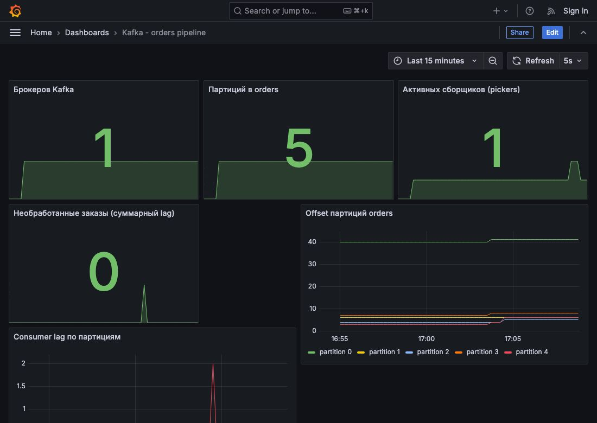

**Грабля:** изначально панели «Брокеров Kafka» и «Партиций» были без `sum(...)` — просто `kafka_brokers or vector(0)`. У `kafka_brokers` есть лейблы (`instance`, `job`), а у `vector(0)` их нет — `or` в PromQL склеивает векторы по совпадению набора лейблов, а раз наборы разные, обе стороны выжили и панель рисовала сразу два числа друг на друге (например, «0» и «1»). `sum(...)` схлопывает результат в одну безлейбловую серию, и с `vector(0)` она уже честно объединяется в одну цифру.

### Три метрики под алерты (`prometheus/alert.rules.yml`)


**KafkaConsumerLagHigh** (`warning`) — суммарный lag группы `pickers` больше 10 дольше 30 секунд. Главный сигнал: сборщики не успевают за потоком заказов (мало партиций/сборщиков либо кто-то завис).

**KafkaNoActivePickers** (`critical`) — в группе `pickers` не осталось ни одного участника. Заказы продолжают копиться в Kafka, но обрабатывать их некому — это уже не деградация, а полная остановка сборки.

**KafkaBrokerDown** (`critical`) — Kafka Exporter не видит ни одного брокера. Самый тяжёлый случай: и продюсер, и все потребители теряют доступ к Kafka разом.

**Грабля:** первая версия правил была вида `sum(kafka_consumergroup_lag{...}) or vector(0) > 10`. В PromQL `or` имеет **более низкий приоритет**, чем операторы сравнения, поэтому это читалось как `sum(...) or (vector(0) > 10)`, а не как ожидалось `(sum(...) or vector(0)) > 10`. `vector(0) > 10` — пусто (0 не больше 10), значит правая часть `or` не мешает, но и не помогает: если `sum(...)` возвращает хоть какое-то значение (даже 0 — лага нет, но серия есть), Prometheus считает алерт **firing**, потому что для alerting-правила важно не значение, а сам факт, что expr вернул непустой результат. Все три алерта горели постоянно, даже когда всё было в порядке. Починили явными скобками: `(sum(...) or vector(0)) > 10`. `KafkaBrokerDown` дополнительно сломался по той же причине, что и панели дашборда (лейблы `kafka_brokers` не совпадают с пустыми лейблами `vector(0)`) — добавили `sum(...)` и туда☺️.

**Проверка:**

```bash
docker compose stop picker-service
# создать 10+ заказов на user-service, чтобы lag вырос выше 10
```

В покое все три правила зелёные:

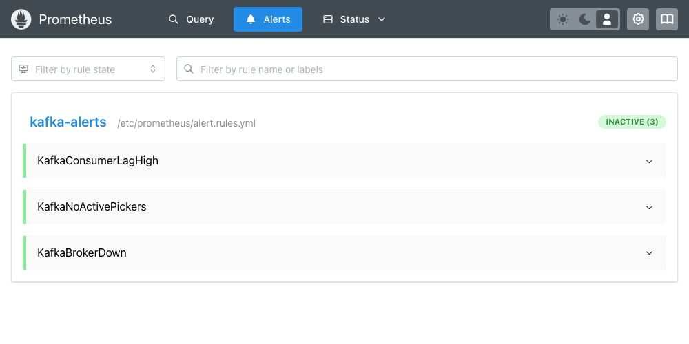

После остановки сборщика и накопления заказов два правила уходят в FIRING (брокер при этом жив, поэтому `KafkaBrokerDown` остаётся INACTIVE):

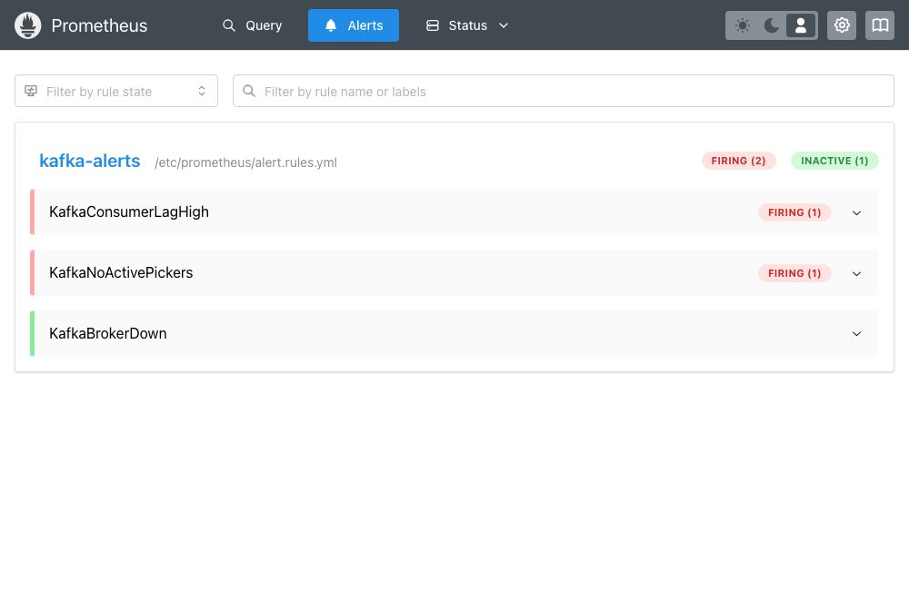

Alertmanager доставил уведомление на тестовый webhook-приёмник:

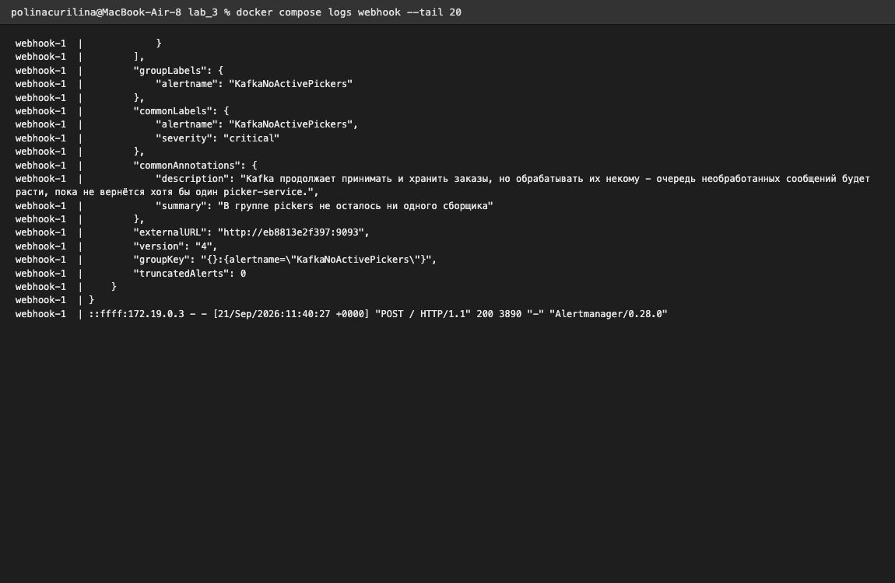


---

## Выводы


Хотя код сервисов был вспомогательной частью, именно в инфраструктурных настройках нашлось больше всего интересного, и почти все «грабли» лабы — на самом деле не баги, а реальные свойства Kafka, которые не видны, пока их не потрогаешь руками(или клодиком😇):

- **Партиции — только вверх.** Kafka физически не умеет уменьшать число партиций существующего топика, и это не ограничение конкретного инструмента, а следствие того, как партиции хранят порядок сообщений. Если бизнесу нужно сократиться после пиковой нагрузки — вариант один: новый топик с меньшим числом партиций и переключение producer/consumer на него.
- **retention.ms работает не так «сразу», как кажется.** Он удаляет только закрытые сегменты лога, а не отдельные сообщения. При низком потоке сообщений активный сегмент может не закрываться неделями (`segment.ms` по умолчанию — тоже 7 дней), и тогда retention формально маленький, а старые данные никуда не деваются. Это ровно то, ради чего в лекции говорили про место на диске: без понимания сегментов легко решить, что retention «не работает», хотя на самом деле работает, просто нечего удалять.
- **Метаданные продюсера кешируются.** После увеличения числа партиций уже запущенный producer какое-то время не в курсе новых партиций и продолжает писать в старые — нужно либо ждать обновления метаданных, либо (что мы и сделали для наглядности) перезапустить сервис.
- **`alter_configs` — не «обновить один параметр», а «заменить весь набор».** Легаси Admin API Kafka не мержит конфиги при изменении, а полностью перезаписывает список динамических настроек ресурса тем, что ты передал в вызове. `incremental_alter_configs` — единственный безопасный способ менять конфиги по одному, не боясь стереть остальное.
- **`or` в PromQL — коварный оператор.** Он не заменяет `IFNULL`/`COALESCE` бездумно: приоритет ниже сравнений (нужны скобки), а склейка серий идёт по точному совпадению набора лейблов, а не «если левая часть пуста». `sum(...)` перед `or vector(0)` почти всегда обязателен, если запрос агрегирует метрику с лейблами.

Чего не хватает для «взрослой» версии:
- несколько брокеров Kafka и настоящий `replication factor > 1` (сейчас 1 брокер, отказоустойчивости нет);
- OpenTelemetry-трейсинг одного заказа через оба сервиса (по аналогии с лабой 2, но через Kafka вместо HTTP);
- маршрутизация алертов по `severity` в Alertmanager (`critical` — отдельный канал, `warning` — другой), а не всё в один webhook;
- постоянные тома для Prometheus/Grafana (сейчас метрики и дашборды переживают `docker compose down`, но не `down -v`);
- Dead-letter queue для «ядовитых» сообщений, которые сборщик не может обработать (в лекции это отдельная тема, в лабе руки до неё не дошли).

---

## Про инструменты

Писали на Python + Flask, Kafka-клиент — `confluent-kafka` (обёртка над librdkafka). Инфраструктура: Docker Compose, Kafka (KRaft), Kafka UI, Prometheus, Alertmanager, Grafana, Kafka Exporter. Пользовались AI-ассистентом — для генерации кода сервисов и конфигов, отладки перечисленных выше багов🐞 и прогона всех бизнес-ситуаций перед тем, как их же повторить руками для скриншотов.


## P.S.
Каждый раз, когда мы с Леночкой произносили слово-пушу, мы вспоминали ее кошечку, ее зовут Пуша.


А еще у Полины тоже есть кошечка Грейс, смотрите!


